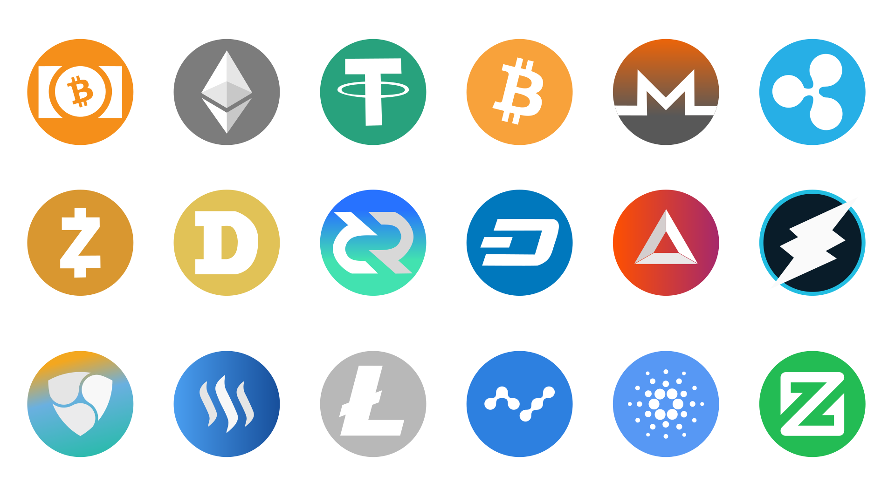

# Crypto For Beginners

> A beginner-friendly guide to understanding cryptocurrency.

---

## Description

Crypto for Beginners is not just another website; it's a gateway for beginners to enter the exciting realm of cryptocurrency with confidence. Our website aims to provide individuals who are new to the digital asset space with an easy-to-understand overview of key concepts, trends, and developments in the crypto sphere. 
Whether you're curious about Bitcoin, Ethereum, Ripple or other cryptocurrencies, Crypto for beginners offers valuable insights to help you navigate this rapidly evolving landscape.

Targeted towards individuals who are seeking to understand cryptocurrency from scratch, Crypto for Beginners offers educational content covering the background of cryptocurrency, its prospects, different types of cryptocurrencies, and more. 
The user-friendly interface and clear explanations make complex topics accessible to anyone interested in exploring the world of cryptocurrencies.

---

## Features

- *Navigation Bar*
  - The fully responsive navigation bar is prominently featured on the Crypto for Beginners main page, providing easy access to essential sections such as About, Background, Future, and 3 Cryptos. This consistent navigation ensures users can seamlessly explore different aspects of cryptocurrency education without any hassle.
  - It is particularly valuable for individuals who are new to the website and want to navigate between sections efficiently to learn more about cryptocurrency. 

- *Back to the top*
  - As the user enters different sections (page areas), there is a “back to the top” button, that makes it easy for the user to go back to the navigation bar without the hassle of scrolling.
 
## Main page

- *Image*
  - Underneath the navigation bar there is a picture of different cryptocurrency logos to give the user a clear indication of what the website is about. On the bottom of the image there is a numbered list featuring the name of the cryptocurrency logos, so the user knows exactly what they are looking at.
  
- *About*
  - The About section offers users an insightful overview of the Crypto for Beginners project, including my own journey, target audience, and the value it aims to provide. This section is vital for users seeking to understand the purpose and relevance of the website, helping them grasp the significance of learning about cryptocurrency in a beginner-friendly manner.

- *Background*
  - The Background section delves into the history and evolution of cryptocurrency, tracing its origins from the late 20th century to the groundbreaking publication of the Bitcoin whitepaper in 2008.
    This feature is valuable for users who are interested in gaining a deeper understanding of the foundational concepts behind cryptocurrency and its revolutionary impact on the financial landscape. 
  
- *Future*
  - The Future section offers insights into the potential trajectory of cryptocurrency adoption and integration into mainstream financial systems. It explores predictions and trends regarding the future of crypto, highlighting opportunities and challenges that lie ahead.
    This feature is beneficial for users looking to stay informed about the latest developments and potential advancements in the cryptocurrency space. 

- *Top 3 Cryptocurrencies*
  - The Top 3 Cryptocurrencies gives an overview of the most popular cryptocurrencies, including Bitcoin, Ethereum, and Ripple, along with their unique features and use cases. By showcasing prominent cryptocurrencies, this section helps users explore the diversity of digital assets and understand their functionalities.
    It is particularly valuable for individuals looking to expand their knowledge and make informed decisions about cryptocurrency investments or participation in blockchain networks. Each cryptocurrency described has its own logo presented, and if pressed it will link the user to an external tab to their respective website.

 ## Features Left to Implement

- Addition of a glossary section to explain common terms and acronyms used in the cryptocurrency space.

---

## Testing

Crypto For Beginners underwent rigorous testing to ensure functionality, usability, and compatibility across different browsers and devices. Validation tests confirmed the absence of errors in both HTML and CSS code. The website was tested on various browsers and screen sizes to ensure a consistent and optimal user experience.

### Validator Testing

- *HTML*
  - No errors were returned when passing through the official [W3C validator](https://validator.w3.org/).
- *CSS*
  - No errors were found when passing through the official [(Jigsaw) validator](https://jigsaw.w3.org/css-validator/).

### Unfixed Bugs

During the testing of responsiveness on different dimensions, there is an issue that effects the main image, the image description and underlines so they do not adhere to the 100% width across all devices.

---

## Deployment

The Crypto For Beginners website was deployed to GitHub Pages. The deployment process involved configuring the repository settings to deploy from the master branch, resulting in automatic deployment upon selection. Users can access the deployed website through the GitHub Pages link.

The live link can be found [here](https://code-institute-org.github.io/love-running-2.0/index.html).

---

## Credits

### Content

- The information provided throughout the Crypto For Beginners website was gathered from various reputable sources covering topics related to cryptocurrency, including articles, whitepapers and educational resources:
  
  [History of crypto](https://worldcoin.org/articles/history-of-cryptocurrency)
  
  [Electronic Cash System](https://revelointel.com/project-breakdown/bitcoin)
  
  [Blockchain & cryptocurrencies](https://www.pwc.com/us/en/industries/financial-services/fintech/bitcoin-blockchain-cryptocurrency.html)

- The Header and Footer color gradient was taken from WC3Schools color picker:
  
  [WC3School color picker](https://www.w3schools.com/colors/colors_picker.asp)

  The font was chosen from WC3Schools CSS Web Safe Fonts

    [WC3School CSS web safe fonts](https://www.w3schools.com/cssref/css_websafe_fonts.php)
  
### Media

- The images used on the Home page are sourced from Pixabay and Crypto logos, an open-source platform for high-quality images.

   [Pixabay link for the main image.](https://pixabay.com/vectors/image-set-interface-pictogram-3375234/)
 
   [Bitcoin, Ethereum and Ripple logos with links.](https://cryptologos.cc/)
 
  
- The links used for the logos on the top 3 cryptocurrencies.
  
  [Bitcoin's website.](https://bitcoin.org/en/)
  
  [Ethereum's website.](https://bitcoin.org/en/)
  
  [Ripple's website.](https://ripple.com/)
